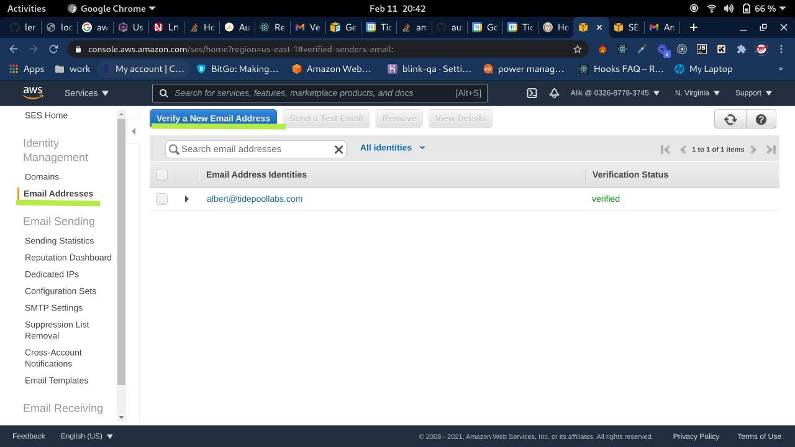
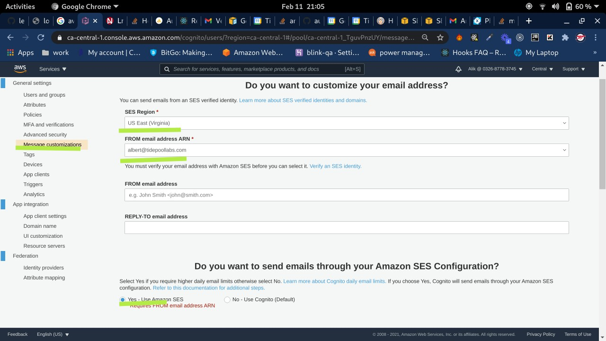

# Deployment using Circleci
1. Connect your repo to circleci
1. Add the github user key on circleci ssh keys page
   https://app.circleci.com/settings/project/github/{ORG_NAME}/{REPO_NAME}/ssh
1. Add `SENTRY_DSN` env variable on circleci project's config page
   https://app.circleci.com/settings/project/github/{ORG_NAME}/{REPO_NAME}/environment-variables
   #### To get `SENTRY_DSN` variable
   - Create a `AWS LAMBDA (NODE)` project on [Sentry](https://sentry.io/organizations/tidepoollabs/projects/new/)
   - Get the DSN from `Client Keys` page
1. Update the **.circleci/config.yml**
   file to set branches to deploy. these branches will deploy by default
    ```yaml
    branches:
      only:
        - develop
        - staging
        - master
    ```
1. Set the environment variables based on git branch on **.circleci/env-setup.sh** file
   - `DOMAIN_NAME` is the domain where the website will be published
   - `SUBDOMAIN_NAME` is the subdomain based on git branch. Generally it should be `www` for `master` branch
   - `STACK_REGION` is the AWS stack region where the branch will be deployed. There is some limitation of stack counts per region, so it should be unique per branch.
   - `APP_NAME` is the stack name on AWS, so it should be unique per branch.

# After deploy steps
### Aws certificate
Set AWS_CERTIFICATE_ARN env var on circleci after first deploy to not recreate certificate on aws
You can find the arn on certificate page on aws.
### Set your verified email as FROM email on cognito (For Prod)
1. Go to the [SES](https://console.aws.amazon.com/ses/home) page on aws console 
1. Verify an email to use in cognito (like no-reply@hcx.ai)
   
1. On Message customizations page of cognito set the FROM email address
   

# Deployment from local machine
1. Copy the `env.sh.template` into `env.sh` file and set the env varables (as specified on circleci section)
1. run `npm run deploy`

# Update the project by your needs
   1. See the `services` directory. there is a simple `programs` service there to show how the structure works.
      There should be `index.js` and `lambda.js` files.
      - `index.js` is for running from local
      - `lambda.js` is for running on aws as lambda function
        Make sure to include `sentry` configuration part on each service's lambda.js files
   1. See the `whole` directory. the code is for combining services from `services` directory to single endpoint
         ```javascript
         const gateway = new ApolloGateway({
            serviceList: [
               { name: 'programs', url: `${process.env.PROGRAMS_URL}graphql` },
               // Define additional services here
            ],
            buildService({ _, url }) {
               return new RemoteGraphQLDataSource({
                  url,
                  willSendRequest({ request, context }) {
                     request.http.headers.set('token', context.token || null);
                     request.http.headers.set(
                             'organizationkey',
                             context.organizationkey || null,
                     );
                  },
               });
            },
         });
         ```
         the services from `services` directory should be described in `serviceList` to be combined into single url.
   1. `process.env.PROGRAMS_URL` is the endpoint of the `programs` service.
      See in `lib/app-stack.js` file
      ```javascript
          // -- Deploying whole federation
          const graphqlLambdaWhole = new lambda.Function(this, Utils.prefixByAppName('graphqlLambdaWhole'), {
            // Where our function is located - in that case, whole folder in the root of our project
            code: lambda.Code.fromAsset(path.join(__dirname, '../whole')),
            // What should be executed once the lambda is invoked - in that case, the `handler` function exported by `lambda.js`
            handler: 'lambda.handler',
            runtime: lambda.Runtime.NODEJS_12_X,
            environment: {
              SENTRY_DSN: Utils.getEnv('SENTRY_DSN'),
              PROGRAMS_URL: graphqlEndpointPrograms.url,
            },
            timeout: cdk.Duration.seconds(100),
          });
      ```
   1. Configure every service you need in `lib/app-stack.js` file like it done for programs service
         ```javascript
             // -- Deploying programs service
             const graphqlLambdaPrograms = new lambda.Function(this, Utils.prefixByAppName('graphqlLambdaPrograms'), {
               // Where our function is located - in that case, in `services/programs` directory at the root of our project
               code: lambda.Code.fromAsset(path.join(__dirname, '../services/programs')),
               // What should be executed once the lambda is invoked - in that case, the `handler` function exported by `lambda.js`
               handler: 'lambda.handler',
               runtime: lambda.Runtime.NODEJS_12_X,
               timeout: cdk.Duration.seconds(30),
               vpc: props.vpc,
               environment: {
                 NODE_ENV: 'production',
                 DATABASE_URL: `postgres://${props.rdsDbUser}:${props.rdsDbPassword}@${props.rdsEndpoint}:${props.rdsPort}/${props.rdsDb}`,
                 SENTRY_DSN: Utils.getEnv('SENTRY_DSN'),
                 BUCKET_NAME: props.s3Bucket.bucketName,
                 BUCKET_URL: 'https://' + props.s3Bucket.bucketDomainName,
                 ENDPOINT: props.rdsEndpoint,
                 PORT: props.rdsPort,
                 DATABASE: props.rdsDb,
                 USERNAME: props.rdsDbUser,
                 PASSWORD: props.rdsDbPassword,
               }
             });
         
             props.s3Bucket.grantReadWrite(graphqlLambdaPrograms);
             props.rdsInstance.grantConnect(graphqlLambdaPrograms);
         
             const graphqlEndpointPrograms = new apiGateway.LambdaRestApi(this, Utils.prefixByAppName('graphqlEndpointPrograms'), {
               handler: graphqlLambdaPrograms,
             });
         ```
   1. Each header used in api requests should be specified in `lib/app-stack.js` like
      ```javascript
      const defaultCorsPreflightOptions = {
            allowOrigins: apiGateway.Cors.ALL_ORIGINS,
            allowHeaders: [...apiGateway.Cors.DEFAULT_HEADERS, 'organizationKey'],
            allowCredentials: true,
          };
      ```
      in this example it's `organizationKey`
   1. Update the package.json to include `install:service` and `dev:service` scripts for each services like
      ```
      "install:programs": "cd ./services/programs && npm install",
      "dev:programs": "nodemon services/programs/index.js"
      ```
   1. Update `dev:gateway` script to await every port from your services
      ```
      "dev:gateway": "wait-on tcp:4001 && nodemon whole/index.js",
      ```
   1. Update `migrate-db.sh` which is used to run your migrations
   1. Update the `userVerification` and `userInvitation` objects
      in `lib/cognito-stack.js` to represent email subject/body when user signs up on your app
# Cron jobs
  Add your cron jobs in services/cron directory and make sure
  to call this.createCron() in cron-stack.js file. See the hello-world cron example
